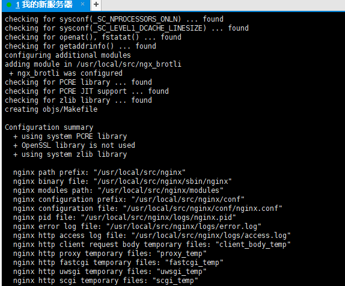
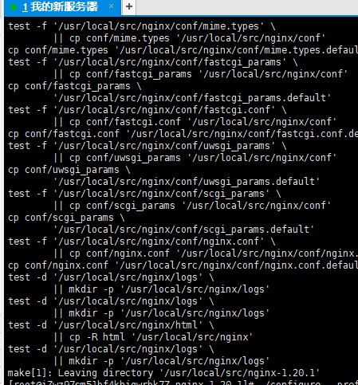

1. 购买云服务器
2. 打开控制台
3. 进入实例，点击更多=》点击密码/密钥=》点击重置实例密码
4. 记住服务器的密码（这个很重要）

# 安装访问服务器的软件

这里我推荐[xshell](https://www.netsarang.com/zh/free-for-home-school/)和[xftp](https://www.netsarang.com/zh/free-for-home-school/)

然后用xshell登陆

linux账户是：root
密码就是刚才重置的密码。

# 安装git

yum install git 

等待安装完成即可

完成

# 安装nginx 和 br

## 安装br

  1. cd /usr/local/src
  2. git clone https://github.com/google/ngx_brotli
  3. cd ngx_brotli
  4. git submodule update --init
  5. 然后可以愉快的安装nginx啦

## 安装nginx

  1. 首先安装[nginx最新版](http://nginx.org/en/download.html)(例如我装的是1.18.0版本)
  2. 下载解压包放置到/usr/local/src 并cd到该位置
  3. tar -zxvf nginx-1.18.0.tar.gz 解压
  4. cd nginx-1.18.0 进入到nginx目录
  5. ./configure --prefix=/usr/local/src/nginx --with-http_gzip_static_module --with-http_stub_status_module --with-http_v2_module --with-http_ssl_module  --add-module=/usr/local/src/ngx_brotli (这里--prefix后面带的是安装目录)
    
  第五步成功的样子是这样的

  
  
  6. make && make install
  
  


## 启动nginx

进入你所指定的 **--prefix** 目录，也就是安装目录，**cd sbin**

然后输入 **./nginx** 启动

> tips：启动nginx之后，你nginx.conf server里面的listen 后面写的端口，服务器会自动打开
> 例如 listen 80  listen 443 重新启动nginx服务器会打开该端口

## 阿里云打开80端口

点击更多，安全组，入方向，打开80端口即可

## 配置nginx环境变量（全局访问）

1. 进入/etc/profile
2. 在文件最后加入一行代码（根据自己的安装目录填写）

> export PATH=$PATH:/usr/local/nginx/sbin

3. source /etc/profile

搞定，现在不必到nginx/sbin下面去执行了

## 配置开机自启动(配不配置都行)

1. vim /usr/lib/systemd/system/nginx.service

写入

```nginx
[Unit]
Description=nginx
After=network.target
   
[Service]
Type=forking
PIDFile=/usr/local/src/nginx/logs/nginx.pid
ExecStart=/usr/local/src/nginx/sbin/nginx
ExecReload=/usr/local/src/nginx/sbin/nginx -s reload
ExecStop=/usr/local/src/nginx/sbin/nginx -s stop
PrivateTmp=true
   
[Install]
WantedBy=multi-user.target
```

路径是你安装后的目录

设置开机自启动：systemctl enable nginx

关闭开机启动：systemctl disable nginx.service

# 拓展(看一看就行)

其它命令

1. 以特定目录下的配置文件启动：nginx -c /特定目录/nginx.conf
2. 重新加载配置：nginx -s reload 执行这个命令后，master进程会等待worker进程处理完当前请求，然后根据最新配置重新创建新的worker进程，完成Nginx配置的热更新。
3. 立即停止服务：nginx -s stop
4. 从容停止服务：nginx -s quit 执行该命令后，Nginx在完成当前工作任务后再停止。
5. 检查配置文件是否正确：nginx -t
6. 检查特定目录的配置文件是否正确：nginx -t -c /特定目录/nginx.conf
7. 查看版本信息：nginx -v

## 安装git
安装：yum install -y git
查看版本：git version

## 安装node

1. curl --silent --location https://rpm.nodesource.com/setup_12.x | sudo bash -

2. yum install -y nodejs

3. node -v

这里版本不重要，等会安装nvm会安装到最新版

## 安装nvm

1. curl -o- https://raw.githubusercontent.com/nvm-sh/nvm/v0.39.0/install.sh | bash

2. 命令行执行 **export NVM_DIR="$([ -z "${XDG_CONFIG_HOME-}" ] && printf %s "${HOME}/.nvm" || printf %s "${XDG_CONFIG_HOME}/nvm")"
[ -s "$NVM_DIR/nvm.sh" ] && \. "$NVM_DIR/nvm.sh"**

3. source ~/.bashrc

[官方文档点这里](https://github.com/nvm-sh/nvm#install-script)

输入 **nvm -v** 查看版本

## 用nvm安装node最新稳定版本

用 **nvm ls-remote** 查看所有可安装的node版本号

找到 有后缀 **(Latest LTS: Gallium)**的

nvm install 该版本即可

然后用 nvm use 切换到该版本

## 安装mysql

[请看阿里云安装数据库得文档](https://help.aliyun.com/document_detail/178136.html)


最后不要忘记，去阿里云安全组打开3306端口和防火墙打开3306端口

已经完成了，可以用数据库软件连接了


## nginx的一些问题

如果nginx已启动，且服务器打开了80端口，可用这个命令查看是否监听了80端口（netstat -lnpt），且阿里云出入口开放了80端口

但是还是无法通过外网ip访问，可以这么操作

1. 看看是不是打开了防火墙

firewall-cmd --state：查看防火墙运行状态，如果提示running 证明防火墙已启动

2. 解决方式1：关闭防火墙，网站即可访问
3. 解决方式2：防火墙内允许80端口

    1. firewall-cmd --permanent --zone=public --add-port=80/tcp --permanent
    2. firewall-cmd --permanent --query-port=80/tcp ：查看端口，提示yes即可
    3. firewall-cmd --reload 添加完端口之后一定要reload一下，重新加载防火墙配置
    4. firewall-cmd --list-all 然后再查看防火墙规则就有80端口号了

解决


# 结语

然后自己配置nginx玩去吧

# 下面我自己看的，不知道有没有用，你们不用管，看看就好

1. nginx/conf，里面新建 **proxy.conf** 文件

proxy_temp_path和proxy_cache_path 是nginx的路径
写入如下配置

```nginx
proxy_temp_path /usr/local/src/nginx/proxy_temp_dir;
proxy_cache_path /usr/local/src/nginx/proxy_cache_dir levels=1:2 keys_zone=cache_one:20m inactive=1d max_size=5g;
client_body_buffer_size 512k;
proxy_connect_timeout 60;
proxy_read_timeout 60;
proxy_send_timeout 60;
proxy_buffer_size 32k;
proxy_buffers 4 64k;
proxy_busy_buffers_size 128k;
proxy_temp_file_write_size 128k;
proxy_next_upstream error timeout invalid_header http_500 http_503 http_404;
proxy_cache cache_one;

```

## 常用的操作
  
### nginx

 1. nginx -v 查看版本号
 2. nginx -V 查看nginx安装的配置
 3. nginx -s stop 停止nginx
 4. nginx -s reload 重启nginx，改完conf文件都要重启
 5. nginx -t 查看当前nginx状态，也可以看到**默认**的配置文件

### 系统操作

 1. cd xx 跟windows一样
 2. ls 查看当前目录下的所有文件
  
### 端口相关

#### 开放端口

1. firewall-cmd --zone=public --add-port=5672/tcp --permanent   # 开放5672端口

2. firewall-cmd --zone=public --remove-port=5672/tcp --permanent  #关闭5672端口

3. firewall-cmd --reload   # 配置立即生效

4. firewall-cmd --zone=public --list-ports 查看防火墙所有开放的端口
5. systemctl stop firewalld.service 关闭防火墙
6. firewall-cmd --state 查看防火墙状态
7. netstat -lnpt （重要） 查看监听的端口
8. netstat -lnpt |grep 5672 （5672是端口号）检查端口被哪个进程占用
9. ps 6832 （6832是进程id）查看进程的详细信息
10. kill -9 6832 中止进程

### 可能访问页面会出现的403错误

这是因为nginx配置指定的用户不对，要指向你当前的用户，请看下面nginx配置第一行

默认是root

### 我的nginx命令

```nginx
  
user  root root;
worker_processes  1;

error_log  logs/error.log;
error_log  logs/error.log  notice;
error_log  logs/error.log  info;

pid        logs/nginx.pid;


events {
    use epoll;
    worker_connections 51200;
    multi_accept on;
}


http {
    include       mime.types;
    default_type  application/octet-stream;
    # 设置缓存路径并且使用一块最大100M的共享内存，用于硬盘上的文件索引，包括文件名和请求次数，每个文件在1天内若不活跃（无请求）则从硬盘上淘汰，硬盘缓存最大10G，满了则根据LRU算法自动清除缓存。
    proxy_cache_path /var/cache/nginx/cache levels=1:2 keys_zone=imgcache:100m inactive=1d max_size=10g;

    include proxy.conf;

    # default_type  application/octet-stream;
    
    server_names_hash_bucket_size 512;
    client_header_buffer_size 32k;
    large_client_header_buffers 4 32k;
    client_max_body_size 100m;

    sendfile   on;
    tcp_nopush on;

    keepalive_timeout 60;

    tcp_nodelay on;

    fastcgi_connect_timeout 300;
    fastcgi_send_timeout 300;
    fastcgi_read_timeout 300;
    fastcgi_buffer_size 64k;
    fastcgi_buffers 4 64k;
    fastcgi_busy_buffers_size 128k;
    fastcgi_temp_file_write_size 256k;
    fastcgi_intercept_errors on;

    #开启和关闭gzip模式
    gzip on;
    #gizp压缩起点，文件大于1k才进行压缩
    gzip_min_length  1k;
    # 设置压缩所需要的缓冲区大小，以4k为单位，如果文件为7k则申请2*4k的缓冲区 
    gzip_buffers     4 16k;
    #nginx对于静态文件的处理模块，开启后会寻找以.gz结尾的文件，直接返回，不会占用cpu进行压缩，如果找不到则不进行压缩
    gzip_static on;
    # 识别http协议的版本,早起浏览器可能不支持gzip自解压,用户会看到乱码
    gzip_http_version 1.1;
    # gzip 压缩级别，1-9，数字越大压缩的越好，也越占用CPU时间
    gzip_comp_level 1;
    # 进行压缩的文件类型。
    gzip_types     text/plain application/json application/javascript application/x-javascript text/javascript text/css application/xml image/jpeg image/gif image/png video/mpeg audio/x-pn-realaudio audio/x-midi audio/basic audio/mpeg audio/ogg audio/* video/mp4;
    # 启用应答头"Vary: Accept-Encoding"
    gzip_vary on;
    # nginx做为反向代理时启用,off(关闭所有代理结果的数据的压缩),expired(启用压缩,如果header头中包括"Expires"头信息),no-cache(启用压缩,header头中包含"Cache-Control:no-cache"),no-store(启用压缩,header头中包含"Cache-Control:no-store"),private(启用压缩,header头中包含"Cache-Control:private"),no_last_modefied(启用压缩,header头中不包含"Last-Modified"),no_etag(启用压缩,如果header头中不包含"Etag"头信息),auth(启用压缩,如果header头中包含"Authorization"头信息)
    gzip_proxied   expired no-cache no-store private auth;
    # (IE5.5和IE6 SP1使用msie6参数来禁止gzip压缩 )指定哪些不需要gzip压缩的浏览器(将和User-Agents进行匹配),依赖于PCRE库
    gzip_disable   "MSIE [1-6]\.";

    limit_conn_zone $binary_remote_addr zone=perip:10m;
	limit_conn_zone $server_name zone=perserver:10m;

    server_tokens off;
    access_log off;

    # 是否启用在on-the-fly方式压缩文件，启用后，将会在响应时对文件进行压缩并返回。
    brotli on;
    # 启用后将会检查是否存在带有br扩展的预先压缩过的文件。如果值为always，则总是使用压缩过的文件，而不判断浏览器是否支持。
    brotli_static always;
    # 设置压缩质量等级。取值范围是0到11.
    brotli_comp_level 6;
    # 设置缓冲的数量和大小。大小默认为一个内存页的大小，也就是4k或者8k。
    brotli_buffers 16 8k;
    # 设置需要进行压缩的最小响应大小。
    brotli_min_length 20;
    # 指定对哪些内容编码类型进行压缩。text/html内容总是会被进行压缩
    brotli_types text/plain application/json application/javascript application/x-javascript text/javascript text/css application/xml image/jpeg image/gif image/png video/mpeg audio/x-pn-realaudio audio/x-midi audio/basic audio/mpeg audio/ogg audio/* video/mp4;

    server {
        listen    80;
        listen    443 ssl http2 default_server;
        ssl_certificate     /usr/local/src/nginx/conf/5630007_www.llongjie.top.pem;
        ssl_certificate_key  /usr/local/src/nginx/conf/5630007_www.llongjie.top.key;
        root /root/dist;
        location / {
            # root /root/dist;
            index index.htm index.html;
        }
    }
    # include /www/server/panel/vhost/nginx/*.conf;
}
```


